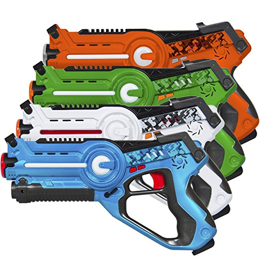

# LaserTarget
Fancy targets for Call of Life "Laser" guns

Also sold under "Legacy Toys" with several knock-offs, this gun-only laser tag uses IR with sensors in the gun.  No vests.  The guns are lightweight and easy to handle for kids, but inevitably two wind up toe to toe yelling at each other.  Giving them a different goal, or at least another target, avoids some of the negatives.

Hardware edit:
https://easyeda.com/editor#id=8795aad828b040029980f1c605d52196|62ddf47768a04f4c813565930e3b1c02

There are several different modes or games:
- Domination
To be played with a single target, teams shoot the target to take posession.  First to control for a combined total of 2 minutes wins.
